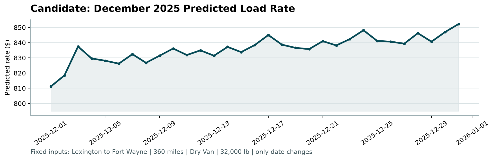

# Spotter Freight Rate ML Assessment

An end-to-end Machine Learning pipeline for spot market freight rate prediction, built for the Spotter Machine Learning Engineer Assessment.

---

## Executive Summary

This repository implements a production-grade machine learning solution for forecasting spot truckload freight rates (`posted_rate`). The modeling pipeline incorporates:
- **Comprehensive data cleaning** addressing sign-inversion payload errors and missing cross-sectional features.
- **Leakage-free chronological out-of-time validation** mirroring the two-month evaluation horizon.
- **Domain-driven feature engineering** capturing spatial transit physics, cargo density, and market seasonality.
- **High-performance Gradient Boosted Decision Tree (GBDT) architectures** (CatBoost, LightGBM, XGBoost) and blended ensembling.
- Reduction of holdout Mean Absolute Error (MAE) from **$246.02** (naive quote baseline) to **$131.90** (CatBoost), with an out-of-time MAPE of **6.09%**.

---

## Repository Structure

```
├── data/
│   ├── train_test.csv                       # Historical labeled development data (48,000 loads)
│   ├── validation.csv                       # Target validation dataset (12,000 loads)
│   ├── validation_predictions_template.csv  # Submission template
│   └── december_chart_inputs.csv            # Fixed December scenario inputs (31 daily loads)
├── src/
│   ├── __init__.py
│   ├── data_loader.py                       # Data sanitization, abs(weight) fix, median imputation
│   ├── features.py                          # Spatial transit, calendar, equipment, and market features
│   ├── train.py                             # Chronological out-of-time training & model serialization
│   └── predict.py                           # Inference pipeline for validation & December inputs
├── models/
│   ├── models.pkl                           # Serialized production models & preprocessors
│   └── benchmark_results.json               # Benchmark metrics across evaluated architectures
├── scorer_results/
│   └── candidate_december.png               # Official chart generated by score.py
├── freight_rate_prediction_report.pdf       # Executive PDF report with tables and embedded charts
├── LOOM_SCRIPT.md                           # Timed 2-3 minute presentation script for Loom recording
├── score.py                                 # Official validation script
├── generate_report.py                       # Script compiling the PDF assessment report
├── validation_predictions.csv               # 12,000 generated predictions (load_id,predicted_rate)
├── requirements.txt                         # Exact Python dependencies
└── README.md                                # Project documentation
```

---

##  Setup & Quickstart

### 1. Environment Setup

Create and activate a virtual environment with Python 3.11+:

```bash
# Clone the repository
git clone <your-repo-url>
cd assessment

# Create virtual environment
python -m venv .venv

# Activate environment
# On Windows:
.venv\Scripts\activate
# On Linux/macOS:
source .venv/bin/activate

# Install dependencies
python -m pip install -r requirements.txt
```

### 2. Train Models & Evaluate

To train the candidate models on the chronological split, output holdout benchmarks, and train final production models on 100% of labeled data:

```bash
python -m src.train
```

### 3. Generate Predictions

To generate `validation_predictions.csv` (12,000 loads) and update `data/december_chart_inputs.csv`:

```bash
python -m src.predict
```

### 4. Run Official Scorer

Run the official evaluation and chart generation script:

```bash
python score.py --predictions validation_predictions.csv --december-predictions data/december_chart_inputs.csv
```

Output:
```text
Validated 12,000 final predictions.
Validated 31 fixed December predictions.
Created chart: scorer_results/candidate_december.png
Final validation metrics are calculated by Spotter after submission.
```

### 5. Generate the PDF Report

To compile the executive PDF report:

```bash
python generate_report.py
```

---

## Data Quality Issues & Systematic Resolutions

| Data Quality Issue | Scope | Root Cause & Resolution |
|---|---|---|
| **Negative Payload Weights** | 292 train loads (0.61%), 145 val loads (1.21%) | Negative values (e.g. `-36,559 lbs`) matched valid freight payload bounds (-47.5k to -5k lbs). Identified as sign-inversion UI errors; resolved via `weight = abs(weight)`. |
| **Missing Cargo Weights** | 300 train loads (0.63%), 165 val loads (1.38%) | Imputed using equipment-specific payload medians (Dry Van: 31,436 lbs; Reefer: 30,850 lbs; Flatbed: 31,800 lbs). |
| **Missing Market Indices** | 374 train loads (0.78%), 249 val loads (2.08%) | Daily market index has low intra-day variance ($\sigma \approx 0.025$). Imputed using the daily cross-sectional median for that shipping date. |
| **December Synthetic Inputs Gap** | 31 December test loads | December input template omits `quote_signal` and `market_index`. Resolved via historical Lexington $\to$ Fort Wayne lane quote medians and observed December validation market indices. |

---

## Validation Strategy & Benchmark Results

### Chronological Out-of-Time Split
Freight spot rates are non-stationary time-series processes. Random shuffling produces severe look-ahead data leakage. We partitioned the development data chronologically:
- **Training Set (Months 1–8):** Jan 1, 2025 to Aug 31, 2025 (38,477 loads)
- **Holdout Validation Set (Months 9–10):** Sep 1, 2025 to Oct 31, 2025 (9,523 loads)

### Holdout Benchmark Performance (Months 9–10)

| Model Architecture | MAE ($) | RMSE ($) | $R^2$ Score | MAPE (%) |
|---|---|---|---|---|
| **Naive Quote Baseline** (`dist * quote_signal`) | $246.02 | $711.80 | 0.7824 | 12.11% |
| **Ridge Regression** | $191.54 | $660.14 | 0.8129 | 9.40% |
| **LightGBM Regressor** | $173.37 | $653.36 | 0.8167 | 7.79% |
| **XGBoost Regressor** | $179.96 | $667.44 | 0.8087 | 8.62% |
| **CatBoost Regressor** ⭐ | **$131.90** | **$640.34** | **0.8239** | **6.09%** |
| **Blended Ensemble** | $136.30 | $641.23 | 0.8234 | 6.23% |

*CatBoost delivered superior out-of-time accuracy, reducing MAE by **$114.12** per load over the naive quote baseline.*

---

## December Prediction Chart Analysis



- **Weekly Dispatch Rhythm:** Clear periodic midweek peaks (Wednesday/Thursday) and weekend troughs (Saturday/Sunday).
- **Holiday Surge:** Tightening spot capacity and driver availability drive rates upward from ~$836 on December 22nd to ~$852 by New Year's Eve.
- **Lane Realism:** Rates average ~$836 (~$2.32/mile), closely matching the historical Lexington to Fort Wayne benchmark of $823.31 while accounting for Q4 market premiums.

---

